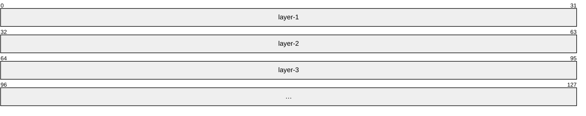
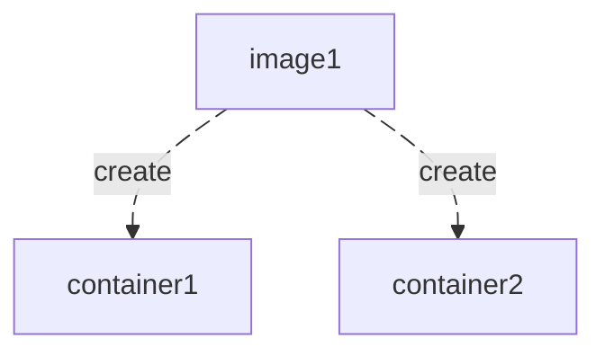

### Docker 游历笔记 1

> The best way to express yourself is to talk to a child using your own tone.

学了三天 Docker，现在可以做一个小总结。我认为 Docker 中最核心的三个概念是 **image、container 和 Dockerfile**。这三者几乎构成了 Docker 最重要的功能基础——就像做饭一样：模板（image）、成品（container）、以及烹饪工具（Dockerfile）都是必不可少的。  

Docker 主要通过一种叫做 **容器** 的技术，实现 **软件和环境的统一部署**。也就是说，我们可以创建一个名为“容器”的环境，这个环境类似于一个迷你操作系统，与宿主机的环境完全隔离。通过合理的构建方式，这个环境可以保证软件在其中稳定运行。需要注意的是，Docker 容器与完整操作系统不同，它不支持 `systemctl` 这样的命令来启动系统服务。  

---

### **镜像（Image）**

**基本概念**：  

- **定义**：Docker image 是 Docker 中的运行模板，保存了容器运行所需的基础软件环境。  
- **构建**：将所需的基础软件和配置打包成镜像的过程，称为构建（build）。  
- **拉取**：从远程仓库下载镜像的过程，称为拉取（pull）。  

要掌握 Docker image，首先要知道如何查看已有镜像：  

```sh
docker images
```

或者等效命令：

```
docker image ls
```

初次使用时，通常没有任何镜像。如果希望获得镜像文件，可以通过两种方式：

1. **从网络仓库获取镜像**
2. **通过 Dockerfile 构建镜像**（在 Dockerfile 中定义所需的基础软件和环境）

例如，从互联网仓库拉取 Ubuntu 镜像的命令如下：

```
docker image pull docker.1ms.run/ubuntu:24.04
```

这里 `docker.1ms.run` 是镜像仓库地址，`ubuntu` 是软件名称，`24.04` 是版本号。拉取成功后，可以使用 `docker images` 查看本地镜像。

值得注意的是，Docker 镜像具有 **分层（layer）** 的概念，这源自联合文件系统（UFS）。虽然不必深入理解 UFS，但需要掌握基本规则：

1. 文件目录分层，高层内容会覆盖低层内容。
2. Dockerfile 中的每条指令都会生成一个新层。
3. 如果某一层的内容未被使用，它不会占用空间，也不会被覆盖。



### **容器（Container）**

容器是由镜像创建出来的运行实例。每个容器都是一个独立的、可执行的软件环境。你可以把它理解成“烹饪出来的成品”，而镜像就是“食材和食谱”。



每个容器都与宿主机隔离，拥有自己的文件系统、进程空间和网络环境。