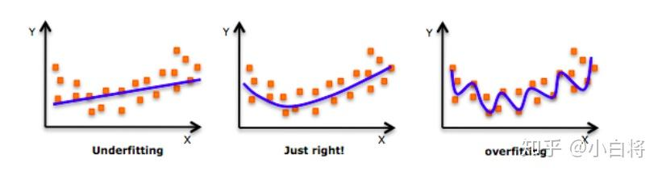
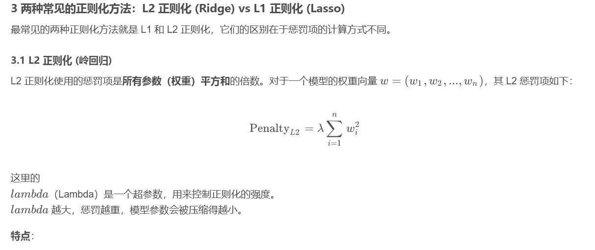
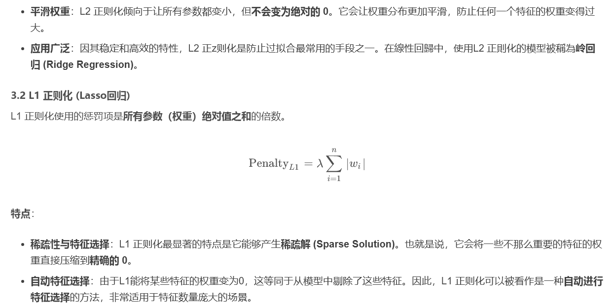

## 背景

[深度学习中的正则化策略综述中提到]([深度学习中的正则化策略综述（附Python代码） - 知乎](https://zhuanlan.zhihu.com/p/37120298))：数据科学专家面临的最常见问题之一是如何避免过拟合。

文章中提到了欠拟合，拟合，和过拟合的三种情况阐述拟合是否将会在实际数据中表现合适，如下图：

左右两种情况是不适合实际数据的表现的，尽管他们在训练数据中表现得优秀。

## 解释

我们认为中间的情况是非常符合数据实际情况的。事实上，我们可以对这一个图示进行更为细致地分析：

如果我们取合适的$[a,b]$区间，我们不难发现，将这些区间上的点集合的中心依次相连接，貌似就是just right的趋势。

但是如果我们按照取每一个点作为一个区间的中心，我们可以得到一个完全overfitting的图像。

相映的，在两端取中心，那么可以得到一个完全underfitting的图像。

## 正则化解决

这篇[正则化文章]([【机器学习】一文彻底搞懂正则化（Regularization）-CSDN博客](https://blog.csdn.net/Zlyzjiabjw547479/article/details/149189783))提到：

在本模型中，由于特征维度不高，我们可以使用岭回归对$[a,b]$区间的大小做惩罚，当$[a,b]$区间选取过大时，对其进行惩罚以减小区间长度防止过拟合。

