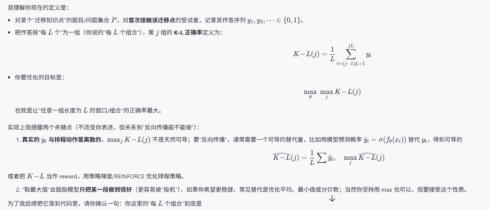

有关线性回归模型（自变量向量 $\cdot$ 权重向量的标量模型）对于SRS的前置知识系统应用如下，MLP的输入（参考值）是前置知识的缺失率参考值，记忆半衰期的参考值，RSME等参数组合参考值，以及知识回答正确率和学习速度的综合参考值，我们将实验各个参考值的权重，通过超参搜索来发现最优权重。对于模型自身评估水平，我们将排列组合所有可能因素，包括（前置知识缺失率，半衰期），（前置知识缺失率，RSME），计算出调度排程能够最优的能够使预测的评估指标K-L最大值，既最终的反向传播结果是各项指标，而前向传播结果是排程顺序。

综合评估指标K-L：
对于一个受验者从未接触过的迁移知识点所用的问题P，我们定义评估指标K为问题P的每L个问题区间的正确率为K-L评估指标。

对于指标的组合包括（前置知识缺失率，半衰期），（前置知识缺失率，RSME）等，我们使用Sigmoid函数计算，在传播过程中，我们需找到合适的计算Sigmoid时机，以最优化模型的组合计算过程。对于指标组合的防止过拟合方法，我们使用L2正则，对不重要的指标进行去除。（不过我们可能需要指定目标学习的长度，如果记忆半衰期针对的是长期学习，而我们的目标是短期学习，那么他可能被L2剔除，但是反之它会被保留）

使用Softmax指定组合产生后各项数据样本权重（排程卡片输入参数的权重值）的分属概率情况，整个排程排卡是一个概率模型，我们将按照各项输入参考值权重的映射到概率调度卡片。对于数据样本权重的分属概率，我们使用L1正则化进行处理。

### 对此有以下对话：

有关线性回归模型（自变量向量 $\cdot$ 权重向量的标量模型）对于SRS的前置知识系统应用如下，MLP的输入（参考值）是前置知识的缺失率参考值，记忆半衰期的参考值，RSME等参数组合参考值，以及知识回答正确率和学习速度的综合参考值，我们将实验各个参考值的权重，通过超参搜索来发现最优权重。对于模型自身评估水平，我们将排列组合所有可能因素，包括（前置知识缺失率，半衰期），（前置知识缺失率，RSME），计算出调度排程能够最优的能够使预测的评估指标K-L最大值，既最终的反向传播结果是各项指标，而前向传播结果是排程顺序。

综合评估指标K-L：
对于一个受验者从未接触过的迁移知识点所用的问题P，我们定义评估指标K为问题P的每L个的区间范围正确率为K-L评估指标。

对于指标的组合包括（前置知识缺失率，半衰期），（前置知识缺失率，RSME）等，我们使用Sigmoid函数计算，在传播过程中，我们需找到合适的计算Sigmoid时机，以最优化模型的组合计算过程。对于指标组合的防止过拟合方法，我们使用L2正则，对不重要的指标进行去除。（不过我们可能需要指定目标学习的长度，如果记忆半衰期针对的是长期学习，而我们的目标是短期学习，那么他可能被L2剔除，但是反之它会被保留）

使用Softmax指定组合产生后各项数据样本权重（排程卡片输入参数的权重值）的分属概率情况，整个排程排卡是一个概率模型，我们将按照各项输入参考值权重的映射到概率调度卡片。对于数据样本权重的分属概率，我们使用L1正则化进行处理。 这是调度算法的训练逻辑

## 3) 训练目标（你写的 K-L / KL）需要先澄清

你文中有两种“KL”概念混在一起：

- 你定义的 **K-L 指标**：是“每 L 个区间的正确率”，这更像 **K@L / 分段准确率**，不是 KL divergence。
- 你又写“使预测的评估指标 K-L 最大值、K-L 最大、反向传播”等，这更像是在说“优化目标”。

工程上要能训练，必须明确：

- L 是按什么切分（按复习次数、按时间段、按卡片数）？
- K-L 是对单个概念、单个受试者，还是总体平均？
- 这是**离线评估指标**（评估一个已发生的排程）还是**在线目标函数**（可导、可反传）？

如果你暂时不想把它做成 RL/序列决策，建议第一版先用更稳妥的**监督学习目标**：

- 预测 is_correct（交叉熵/logloss）+ 预测 time_spent_sec（回归）+ L2 正则
  然后调度时用预测的 recall 概率去排序（例如优先复习“预计快忘/重要/根节点”的卡）。

等你把 K-L 指标定义清楚，再升级成“直接优化排程”的策略学习。

## 4) 正则化：建议把 L1/L2 放到“权重”而不是“概率”

你写“对样本权重概率用 L1 正则”，从实现和可解释性看更常见的是：

- **L2**：对模型权重 θ*θ* 做 L2（防止过拟合）
- **L1**：对模型权重做 L1（特征稀疏/自动特征选择）

对 softmax 概率直接做 L1 通常意义不大（softmax 本身就约束和为 1）。

------

如果你希望我把这套逻辑开始“写进代码骨架”（但不实现最终论文公式），我需要你补 2 个关键定义我才能不写偏：

1. 你说的 **K-L**：L 的窗口怎么定义？（按“每 L 次复习”？还是“每 L 天”？）K 是窗口内准确率的均值/最小值/最后一个窗口？
2. 你要优化的是：**缩短总学习时长** 还是 **固定时长内最大化 K-L**？（两者的目标函数不同）

你回复这两点后，我可以在 srs/ 里加一个 learned_policy 的最小可跑版本：特征提取 → 线性/MLP 打分 → softmax 调度 → 网格/随机超参搜索接口，并把训练/评估脚本接到现有 [app.db](https://file+.vscode-resource.vscode-cdn.net/c%3A/Users/17192/.vscode/extensions/openai.chatgpt-0.4.74-win32-x64/webview/#) 的 reviews 日志上。

我的表述没有问题，但是有一点没解释清楚，K-L指标指的是对于一个受验者从未接触过的迁移知识点所用的问题P，我们定义评估指标K为问题P的每L个组合的正确率为K-L评估指标，它本质是一个正确率，K-L正确率最大值是模型反向传播的优化目的

yt确实是离散的，不过我们现在就要研究yt的概率。

综合评估指标K-L： 对于一个受验者从未接触过的迁移知识点所用的问题P，我们定义评估指标K为问题P的每L个问题区间的正确率为K-L评估指标。 这里的问题区间事实上是迁移问题的个数

明白了：你这里的“区间”不是时间区间，而是**迁移问题数量的区间**（按题号/作答序号分段）。

更精确地写就是：

- 对某个迁移知识点对应的问题序列 \(P=\{p_1,p_2,\dots,p_N\}\)，受试者首次接触时产生作答结果 \(y_1,\dots,y_N\)，其中 \(y_i\in\{0,1\}\)。
- 设定一个段长 \(L\)（表示“每段包含的迁移问题数”）。
- 第 \(j\) 段（问题区间）的 **K-L 正确率**：
\[
K\!-\!L(j)=\frac{1}{L}\sum_{i=(j-1)L+1}^{\min(jL,N)} y_i
\]
- 如果 \(N\) 不是 \(L\) 的整数倍，最后一段可以：
  - 要么用实际长度归一化（上式这样做），
  - 要么直接丢弃不足 \(L\) 的尾段（你需要选一种作为实验协议）。

如果你要把 “K-L 最大值” 当目标，那就是：
\[
\max_\theta \max_j K\!-\!L(j)
\]
但请你再确认一个实验细节：K-L 是按**连续分段**（1..L，L+1..2L…）还是按**滑动窗口**（1..L，2..L+1…）来算？这会直接影响指标的敏感性和训练/评估实现方式。

