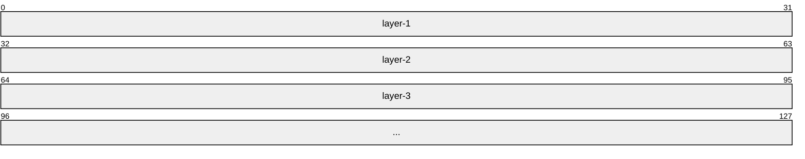
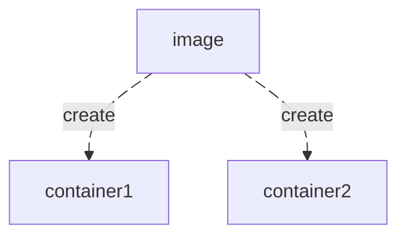

### Docker游历笔记1

​	The best way to express yourself is to talk to a child using your own tone.

---

学了三天的docker，现在可以做一个小的总结，我认为docker中最具有代表性的三个概念当属**image，container和DOCKFILE**这三个概念。这几乎构成了docker最重要功能的基础——烹饪模板，烹饪成品，以及烹饪食材工具。（做饭也是需要这三件）

Docker主要是通过一种叫做容器的技术来进行**软件和环境的一同部署**，换言之，我们创建了一个叫”容器“的环境，这种环境类似于一个迷你操作系统，其中的环境与当前所使用的主机的环境是隔离的，并且使用合理的构建方式，可以使其具备优良的运行环境。后面我们会知道docker容器是与OS不同的，我所知道的一点是，他不能具有systemctl这种启动命令来挂载服务。

### **镜像**：

Basic concept :

- **定义**: Docker image 是docker中的运行模板，它保存了docker在运行前的软件基础。

- **构建**：将Docker image的所需软件基础等搭建起来的过程叫做构建。
- **拉取**：指的是从远程的一个存储服务器上，下载一个docker image镜像的过程。

对于docker-image，我认为必须掌握如下的一些命令：

第一个是用于**展示出当前docker中所存在的所有镜像**的命令。

```sh
docker images
```

或者**也可以写作**

```sh
docker image ls
```

默认不会有任何镜像，如果你希望获得一个镜像文件，可以通过以下两种方式：

1. **网络获取镜像**
2. **Dockerfile**（通过Dockerfile的撰写可以定义docker构建所使用的软件基础等）

如果你希望从互联网的仓库中拉取一个Docker镜像，你可以使用以下命令：

```sh
docker image pull docker.1ms.run/ubuntu:24.04
```

docker.1ms.run是一个**镜像仓库地址**，后面我们会提到它，ubuntu是软件名，而后面的24.04是版本号。我们后续拉取镜像都会使用这样的格式进行拉取。

(如果你成功拉取到了一个docker image，你可以使用 docker images 查看它。)

docker的构建是具有 *层* 这个概念的，这个概念来源于UFS（联合文件系统），我们无需知道这个UFS的具体定义，只需要看下它的规则就可以：

1. 文件目录是分层的，他们具有屏蔽的规则，高层级文件层会屏蔽（覆盖）低层级文件层
2. 每一条Dockerfile指令都是一个新层
3. 如果Dockerfile的文件层上的内容没有被使用，那么他不会占据一个层，同样也不会被屏蔽



### **容器**：




